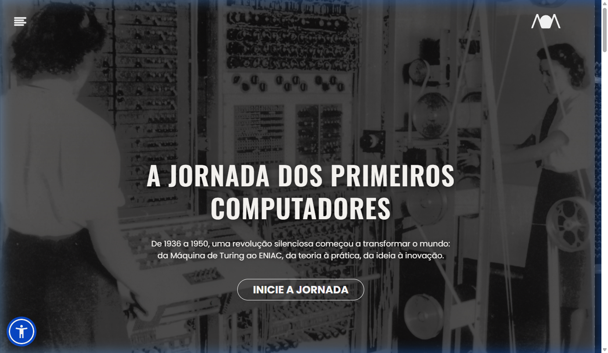
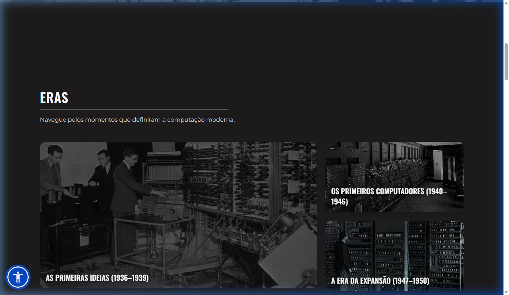
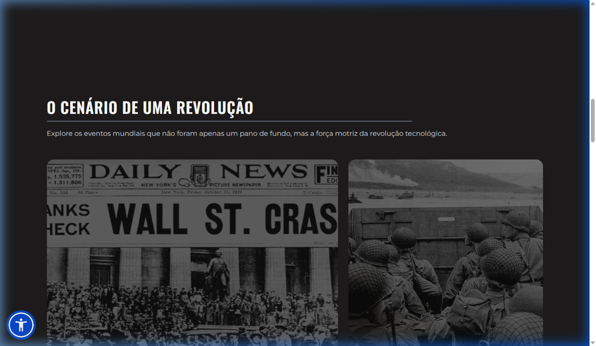

<p align="center">
  
</p>

<h1 align="center">🌅 Aurora — A Jornada dos Primeiros Computadores</h1>

<p align="center">
  <em>Um projeto educacional interativo sobre a história da computação (1936–1950)</em>
</p>

<p align="center">
  <a href="https://twkryan.github.io/Aurora---Site-sobre-Os-Primeiros-Computadores/">
    
  </a>
</p>

<p align="center">
  
  
  
  
  
  
</p>

---

## 📖 Sobre o Projeto

**Aurora** é um site educacional e interativo que explora a fascinante história dos primeiros computadores, desde as ideias teóricas de Alan Turing em 1936 até a era da expansão em 1950. O nome "Aurora" simboliza o amanhecer de uma nova era — o instante em que a humanidade começou a iluminar o futuro com o brilho da inovação tecnológica.

O projeto foi desenvolvido como **Projeto Integrado** do primeiro ano do ensino médio na **ETEC SEBRAE** (Centro Paula Souza), São Paulo.

> *"Assim como o amanhecer anuncia a chegada da luz após a escuridão, o período entre 1936 e 1950 marcou o nascer da computação moderna."*

---

## 🖥️ Preview

<p align="center">
  
</p>

<details>
<summary><strong>📸 Ver mais screenshots</strong></summary>
<br/>

| Seção Eras | Cenário da Revolução |
|:---:|:---:|
|  |  |

</details>

---

## ✨ Funcionalidades

| Funcionalidade | Descrição |
|---|---|
| 🏛️ **Explorar por Eras** | Navegue pela linha do tempo: 1936–1939, 1940–1946 e 1947–1950 |
| 📚 **Explorar por Temas** | Fundamentos teóricos, era eletromecânica, revolução eletrônica e mais |
| 👤 **Biografias Interativas** | Conheça Alan Turing, Claude Shannon e outros pioneiros |
| 🌍 **Contexto Histórico** | Entenda como guerras e geopolítica aceleraram a tecnologia |
| 🧠 **Quiz Interativo** | Teste seus conhecimentos sobre história da computação |
| 🌐 **Multilíngue** | Suporte a Português e Inglês via Weglot |
| ♿ **Acessibilidade** | Widget de acessibilidade integrado (Sienna Accessibility) |
| 🎨 **Animações** | Efeitos visuais com GSAP e scroll reveal |
| 📱 **Responsivo** | Layout adaptado para desktop, tablet e mobile |

---

## 🗂️ Estrutura do Projeto

```
Aurora/
├── index.html              # Página principal
├── pages/
│   ├── conteudo/            # 36 páginas de conteúdo (biografias, artigos, sobre nós)
│   ├── eras/                # 3 páginas de eras históricas
│   ├── temas/               # 6 páginas temáticas
│   └── Quiz.html            # Quiz interativo
├── assets/
│   └── img/                 # Imagens do projeto (~220 arquivos)
│       ├── imgs_conteudos/  # Imagens dos artigos
│       └── img-cards-veja-mais/
├── js/
│   ├── MenuEHeader.js       # Menu lateral e navegação
│   ├── Quiz.js              # Lógica do quiz (PT-BR)
│   ├── QuizEn.js            # Lógica do quiz (EN)
│   ├── ScrollReveal.js      # Animações de scroll
│   ├── tradução.js          # Sistema de tradução
│   ├── carrosel-main.js     # Carrossel da página inicial
│   ├── carrossel-temas.js   # Carrossel de temas
│   ├── LightMode.js         # Modo claro
│   ├── preloader.js         # Tela de carregamento
│   └── scrollToEras.js      # Scroll suave para seções
├── style/
│   ├── input.css            # CSS fonte (Tailwind)
│   ├── MenuEHeader.css      # Estilos do menu/header
│   └── output.css           # CSS compilado (gerado automaticamente)
├── docs/                    # Screenshots para o README
├── package.json             # Dependências do projeto
├── .gitignore
├── .editorconfig
└── LICENSE
```

---

## 🛠️ Tech Stack

<table>
  <tr>
    <th>Categoria</th>
    <th>Tecnologia</th>
    <th>Uso</th>
  </tr>
  <tr>
    <td><strong>Estrutura</strong></td>
    <td>HTML5</td>
    <td>Semântica e acessibilidade</td>
  </tr>
  <tr>
    <td><strong>Estilização</strong></td>
    <td>Tailwind CSS v4 + DaisyUI</td>
    <td>Design system utilitário e componentes</td>
  </tr>
  <tr>
    <td><strong>Estilização</strong></td>
    <td>CSS3 Vanilla</td>
    <td>Estilos customizados (menu, header)</td>
  </tr>
  <tr>
    <td><strong>Interatividade</strong></td>
    <td>JavaScript (ES6+)</td>
    <td>Quiz, menu, carrosseis, tradução</td>
  </tr>
  <tr>
    <td><strong>Animações</strong></td>
    <td>GSAP</td>
    <td>Animações avançadas e scroll reveal</td>
  </tr>
  <tr>
    <td><strong>Tradução</strong></td>
    <td>Weglot</td>
    <td>Internacionalização PT↔EN</td>
  </tr>
  <tr>
    <td><strong>Acessibilidade</strong></td>
    <td>Sienna Accessibility</td>
    <td>Widget de acessibilidade integrado</td>
  </tr>
  <tr>
    <td><strong>Hospedagem</strong></td>
    <td>GitHub Pages</td>
    <td>Deploy estático gratuito</td>
  </tr>
  <tr>
    <td><strong>Tipografia</strong></td>
    <td>Google Fonts</td>
    <td>Oswald, Poppins, Montserrat, Playfair Display</td>
  </tr>
</table>

---

## 🚀 Como Rodar Localmente

**Pré-requisitos:** [Node.js](https://nodejs.org/) instalado.

```bash
# 1. Clone o repositório
git clone https://github.com/twkryan/Aurora---Site-sobre-Os-Primeiros-Computadores.git

# 2. Acesse a pasta do projeto
cd Aurora---Site-sobre-Os-Primeiros-Computadores

# 3. Instale as dependências
npm install

# 4. Compile o CSS do Tailwind
npm run build

# 5. Abra o index.html no navegador
# Você pode usar a extensão "Live Server" do VS Code ou simplesmente abrir o arquivo
```

Para **desenvolvimento com hot-reload** do CSS:
```bash
npm run dev
```

---

## 👥 Equipe

<table>
  <tr>
    <td align="center">
      <a href="https://github.com/twkryan">
        
        <br/>
        <sub><b>Ryan Felipe</b></sub>
      </a>
      <br/>
      <sub>HTML, CSS, Design e Interatividade</sub>
    </td>
    <td align="center">
      <a href="https://github.com/tunes0">
        
        <br/>
        <sub><b>João Miguel</b></sub>
      </a>
      <br/>
      <sub>Design</sub>
    </td>
    <td align="center">
      <a href="https://github.com/lucassb1673">
        
        <br/>
        <sub><b>Lucas Souza</b></sub>
      </a>
      <br/>
      <sub>HTML, CSS e Interatividade</sub>
    </td>
    <td align="center">
      <a href="https://github.com/Pedro018">
        
        <br/>
        <sub><b>Pedro Henrique</b></sub>
      </a>
      <br/>
      <sub>Interatividade</sub>
    </td>
  </tr>
</table>

<p align="center">
  <strong>Projeto desenvolvido na <a href="#">ETEC SEBRAE</a> — Centro Paula Souza, São Paulo/SP</strong>
</p>

---

## 📄 Licença

Este projeto está sob a licença MIT. Veja o arquivo [LICENSE](./LICENSE) para mais detalhes.

---

<p align="center">
  
  <br/>
  <em>Feito com 💛 pela equipe Aurora — ETEC SEBRAE, 2025</em>
</p>
